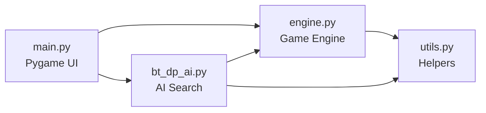
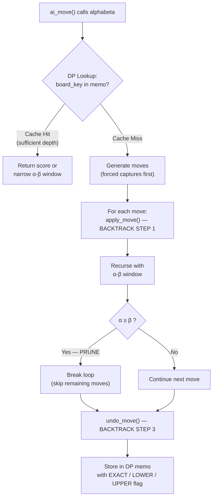
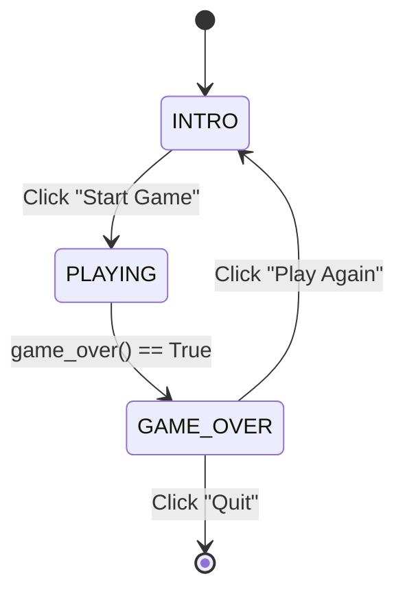

# Review 3 — Checkers Game with Backtracking, Dynamic Programming & Alpha-Beta Pruning

## 1. The "What" — System Overview

This project implements a fully playable **8×8 Checkers (Draughts) game** in Python with Pygame, where a human player (Red) competes against an AI opponent (Blue).

### Architecture

| File | Role | Lines |
|------|------|-------|
| `utils.py` | Shared constants & helper functions | ~50 |
| `engine.py` | Game state, rules, move generation, evaluation | ~310 |
| `bt_dp_ai.py` | AI search: Alpha-Beta + Backtracking + DP | ~200 |
| `main.py` | Pygame UI: intro screen, gameplay, game-over | ~350 |



### Implemented Game Rules

| Rule | Description |
|------|-------------|
| **Diagonal Movement** | Men move diagonally forward by 1 square |
| **King Promotion** | A man reaching the opponent's back row becomes a King |
| **King Movement** | Kings move diagonally in all 4 directions |
| **Capture** | Jump over an adjacent opponent piece to an empty square behind it |
| **Forced Capture** | If a capture is available, the player **must** capture |
| **Multi-Jump / Chain Capture** | After one capture, if the same piece can capture again, it **must** continue |
| **Winning Condition** | Capture all opponent pieces, or leave them with no legal moves |

---

## 2. The "Why" — Justification for Backtracking + DP

### Why not a simple loop or brute-force search?

A Checkers game tree is **enormous**. At any position, a player might have ~7–12 legal moves, and the game can last 50+ moves.

| Approach | Complexity | Feasible? |
|----------|-----------|-----------|
| Brute-force (all paths) | $O(b^d)$ where $b \approx 10$, $d = 50$ → $10^{50}$ states | ❌ Impossible |
| Basic Minimax (depth-limited) | $O(b^d)$ where $d = 6$ → $10^6$ nodes | ⚠️ Slow |
| Minimax + Memoisation (DP) | Eliminates duplicate states → significant reduction | ✅ Good |
| **Alpha-Beta + DP** (our approach) | **$O(b^{d/2})$** → $10^3$ nodes at $d = 6$ | ✅ **Optimal** |

### Why Backtracking?

The naive approach to game-tree search would **clone the entire board** at every node:

```python
# ❌ NAIVE: O(n) copy at every node, d levels deep → O(n × b^d) memory
new_board = copy.deepcopy(board)
new_board.apply(move)
score = minimax(new_board, depth - 1)
```

Our backtracking approach **mutates the board in place** and undoes the mutation after recursion:

```python
# ✅ BACKTRACKING: O(1) apply/undo, only one board in memory
info = engine.apply_move(move)       # Step 1: Apply (mutate)
score = minimax(engine, depth - 1)   # Step 2: Recurse
engine.undo_move(move, info)         # Step 3: Undo (restore)
```

**Panel-Style Justification**: By using `apply_move` / `undo_move`, we maintain a *single board instance* throughout the entire search tree. The `info` dict returned by `apply_move` stores exactly what changed (captured pieces, promotion flag), so `undo_move` can restore the previous state in O(1). This reduces memory from $O(n \times b^d)$ to $O(n + d)$.

### Why Dynamic Programming (Memoisation)?

In a game tree, the *same board position* can be reached via different move orderings. For example:

```
Move sequence A: Red(5,0)→(4,1), then Red(5,2)→(4,3)
Move sequence B: Red(5,2)→(4,3), then Red(5,0)→(4,1)
```

Both sequences produce the **identical board state**. Without memoisation, the subtree below this state would be evaluated **twice** (or more).

**Our solution**: The `board_key()` method generates a unique, hashable fingerprint for every board state:

```python
def board_key(self) -> frozenset:
    """Only occupied squares → fewer items to hash."""
    return frozenset(
        (pos, piece) for pos, piece in self.board.items() if piece
    )
```

The transposition table (`memo` dict) maps `(board_key, depth, maximising)` → cached score, preventing redundant evaluation of duplicate states.

**Panel-Style Justification**: This is the classic Dynamic Programming optimisation — overlapping subproblems (same board reached via different paths) are solved only once and stored for O(1) re-use. The `frozenset` key is order-independent and only includes occupied squares, making hashing faster than `tuple(sorted(...))`.

---

## 3. The "How" — Algorithm Breakdown

### 3.1 The Minimax Algorithm

Minimax is a decision rule for two-player zero-sum games. It alternates between:
- **Maximiser** (AI): picks the move with the *highest* score
- **Minimiser** (opponent): picks the move with the *lowest* score

```
          MAX (AI)
         /    \
       MIN    MIN
      / \    / \
    MAX MAX MAX MAX
     ↓   ↓   ↓   ↓
   eval eval eval eval
```

At depth 0 (leaf nodes), the board is scored using the evaluation heuristic. Scores are propagated upward — maximiser picks max, minimiser picks min.

### 3.2 Alpha-Beta Pruning

Alpha-Beta adds two bounds to Minimax:
- **α (alpha)**: The best score the maximiser can guarantee *so far*
- **β (beta)**: The best score the minimiser can guarantee *so far*

**Key insight**: If at any node $\alpha \geq \beta$, the remaining sibling moves **cannot** affect the final result and are **pruned** (skipped).

```python
# From bt_dp_ai.py — the pruning logic
if maximizing:
    best = max(best, val)
    alpha = max(alpha, val)
else:
    best = min(best, val)
    beta = min(beta, val)

# ALPHA-BETA PRUNE
if alpha >= beta:
    break  # Skip remaining siblings — they can't improve the outcome
```

**Panel-Style Justification**: Without pruning, Minimax evaluates all $b^d$ nodes. Alpha-Beta prunes branches where the opponent already has a better alternative, reducing the tree to $O(b^{d/2})$ in the best case. This means searching to depth 6 with Alpha-Beta is as fast as depth 3 without it.

### 3.3 The Complete Search — BT + DP + Alpha-Beta

Here is how all three techniques work together in a single recursive call:

```python
def alphabeta_bt_dp(engine, depth, alpha, beta, maximizing, player):
    
    # ── DP LOOKUP ──
    key = (engine.board_key(), depth, maximizing)
    if key in memo:
        entry = memo[key]
        if entry['depth'] >= depth:
            if entry['flag'] == EXACT:
                return entry['score']          # Cache hit → skip subtree
            elif entry['flag'] == LOWER_BOUND:
                alpha = max(alpha, entry['score'])  # Narrow window
            elif entry['flag'] == UPPER_BOUND:
                beta = min(beta, entry['score'])     # Narrow window
            if alpha >= beta:
                return entry['score']          # Pruned by cached bound

    # ── TERMINAL / BASE CASE ──
    if engine.game_over():
        return ±1000 ± depth    # Depth-adjusted for win-sooner preference
    if depth == 0:
        return engine.evaluate(player)   # Static heuristic

    # ── RECURSIVE SEARCH ──
    for move in engine.generate_moves(current_player):
        info = engine.apply_move(move)           # ← BACKTRACKING: Apply
        val = alphabeta_bt_dp(engine, depth-1, alpha, beta, ...)  # Recurse
        engine.undo_move(move, info)             # ← BACKTRACKING: Undo

        # Update α or β
        if alpha >= beta:
            break    # ← ALPHA-BETA PRUNE

    # ── DP STORE ──
    memo[key] = {'score': best, 'flag': flag, 'depth': depth}
    return best
```



### 3.4 Transposition Table Flags

When Alpha-Beta prunes a subtree, the score may not be exact. We record the *type* of result:

| Flag | Meaning | When set |
|------|---------|----------|
| `EXACT` | Score is exact — no pruning occurred | `original_alpha < best < beta` |
| `LOWER_BOUND` | Score is at least this high | Beta cut-off (`best ≥ beta`) |
| `UPPER_BOUND` | Score is at most this low | Alpha cut-off (`best ≤ original_alpha`) |

On future lookups, these flags allow the search to either return immediately (EXACT) or tighten the α-β window (LOWER/UPPER), enabling even more pruning.

---

## 4. Algorithm Analysis

### 4.1 Time Complexity

| Component | Without DP/Pruning | With DP + Alpha-Beta |
|-----------|-------------------|---------------------|
| **Minimax search** | $O(b^d)$ | $O(b^{d/2})$ best case |
| **Move generation** | $O(n)$ per node ($n$ = pieces) | Same |
| **board_key** | — | $O(k)$ per node ($k$ = occupied squares) |
| **Memo lookup** | — | $O(1)$ amortised (dict) |

Where:
- $b$ = branching factor ≈ 7–12 legal moves per position
- $d$ = search depth (6 in our implementation)
- $k$ = number of occupied squares (≤ 24 at game start, decreases as pieces are captured)

**Concrete example** from runtime output:

```
[AI] Depth 6 | Nodes searched: 2810
```

Without Alpha-Beta, depth 6 with $b = 10$ would explore up to $10^6 = 1{,}000{,}000$ nodes. Our implementation explores only **~2,800 nodes** — a **99.7% reduction** thanks to Alpha-Beta pruning and DP memoisation.

### How DP Reduces the State Space

The total possible board states in Checkers is finite (~$5 \times 10^{20}$). Without memoisation, the search tree grows as $O(b^d)$ because the same position can be revisited through different move orderings. With our transposition table:

$$T_{\text{with DP}} \leq \min(b^{d/2}, |\text{unique states}|)$$

This means the search never evaluates the same position twice, and Alpha-Beta further halves the effective exponent.

### 4.2 Space Complexity

| Component | Space | Notes |
|-----------|-------|-------|
| **Board** | $O(n)$ | Single dict, $n$ = 32 dark squares |
| **Recursion stack** | $O(d)$ | One frame per depth level |
| **Undo info per level** | $O(c)$ | $c$ = captured pieces (≤ chain length) |
| **Transposition table** | $O(|S|)$ | $|S|$ = unique states encountered |
| **Total** | $O(n + d + |S|)$ | |

**Comparison with naive cloning**:

| Approach | Space per search |
|----------|-----------------|
| Board cloning | $O(n \times b^d)$ — one copy per node |
| **Our backtracking** | $O(n + d)$ — one board + stack |

**Panel-Style Justification**: The backtracking approach reduces space from exponential $O(n \times b^d)$ to linear $O(n + d)$. The only significant memory consumer is the transposition table, which grows with the number of *unique* positions encountered — a worthwhile trade-off since each stored entry prevents an entire subtree re-evaluation.

---

## 5. The Backtracking Step — Detailed Proof

The backtracking pattern follows the classic **explore → recurse → restore** paradigm:

### Step 1: Apply (Explore)

```python
def apply_move(self, move: MovePath) -> MoveInfo:
    """Mutate the board to reflect the move."""
    piece = self.board[start]
    self.board[start] = None       # Remove from source

    # Remove captured pieces (for each jump leg)
    for each jump:
        mid = midpoint between source and destination
        captured_list.append((mid, self.board[mid]))  # Save for undo
        self.board[mid] = None

    self.board[final] = piece      # Place at destination
    # Check promotion ...
    self.turn = opponent(self.turn)
    
    return {'piece': piece, 'captured': captured_list, 'promoted': promoted}
```

### Step 2: Recurse

```python
score = alphabeta_bt_dp(engine, depth - 1, alpha, beta, not maximizing, player)
```

### Step 3: Undo (Restore)

```python
def undo_move(self, move: MovePath, info: MoveInfo) -> None:
    """Restore the board to its pre-move state."""
    self.board[final] = None                    # Clear destination
    self.board[start] = info['piece']           # Restore original piece

    for pos, captured_piece in info['captured']:
        self.board[pos] = captured_piece        # Restore captured pieces

    self.turn = opponent(self.turn)
```

**Why this is correct**: Every mutation made by `apply_move` is recorded in the `info` dict. The `undo_move` function reverses each mutation in the opposite order, guaranteeing the board returns to its exact prior state. This allows the parent node to try the next sibling move on a clean board.

---

## 6. The DP Step — Preventing Exponential Explosion

### The Problem: Transpositions

```
Red moves (5,0)→(4,1) then (5,2)→(4,3)     ─┐
Red moves (5,2)→(4,3) then (5,0)→(4,1)     ─┤→ SAME BOARD STATE
Red moves (5,4)→(4,3) then (5,2)→(4,1) ... ─┘
```

Without memoisation, each of these paths leads to independent subtree evaluations — exponential redundancy.

### The Solution: `board_key` + `memo`

```python
# engine.py — Unique hash for each board state
def board_key(self) -> frozenset:
    return frozenset(
        (pos, piece) for pos, piece in self.board.items() if piece
    )
```

```python
# bt_dp_ai.py — Lookup before computing
key = (engine.board_key(), depth, maximizing)
if key in memo:
    return memo[key]['score']   # O(1) — skip entire subtree

# ... expensive computation ...

memo[key] = {'score': best, 'flag': flag, 'depth': depth}  # Store for future
```

**Panel-Style Justification**: The `board_key` reduces the board to an immutable `frozenset` of occupied squares. Since `frozenset` is hashable, it can be used as a dictionary key with O(1) average lookup. Including `depth` and `maximizing` in the key ensures scores computed at different search depths are not confused. This is the standard "transposition table" technique from professional chess/checkers engines.

---

## 7. Evaluation Heuristic

The static evaluation function scores the board when the search reaches its depth limit:

```python
def evaluate(self, player: str) -> float:
    for (row, col), piece in self.board.items():
        value = 3.0 if piece.isupper() else 1.0   # Material

        # Positional bonuses:
        value += advancement_bonus(row, piece)      # Closer to promotion
        value += 0.5 if col in {0, 7}               # Edge safety
        value += 0.3 if (row, col) in center_zone   # Centre control
        value += 0.2 if on_home_row(piece, row)      # Back-row defence

        score += value if own_piece else -value
    return score
```

| Factor | Weight | Strategic Rationale |
|--------|--------|-------------------|
| Man (material) | +1.0 | Base value |
| King (material) | +3.0 | Kings dominate — they move in all 4 directions |
| Edge column | +0.5 | Cannot be captured from one side |
| Advancement | +0.1 × rows | Pieces closer to promotion are more threatening |
| Centre control | +0.3 | Central pieces influence more diagonals |
| Back-row defence | +0.2 | Prevents opponent from freely promoting |

---

## 8. UI State Machine

The game UI is implemented as a clean state machine:



| Screen | Features |
|--------|----------|
| **Intro** | Title, detailed rules & instructions, Start button |
| **Playing** | Wood-themed board, piece shadows, yellow selection highlight, valid-move dots, smooth AI animation |
| **Game Over** | Translucent overlay, winner announcement, Play Again & Quit buttons |

---

## 9. File-by-File Summary

### `utils.py`
Constants (`BOARD_SIZE`) and pure helper functions (`in_bounds`, `opponent`). Avoids circular imports.

### `engine.py`
Contains the `CheckersEngine` class with:
- `_init_board()` — standard opening layout
- `generate_moves()` — forced captures + multi-jump chains
- `apply_move()` / `undo_move()` — backtracking interface
- `board_key()` — DP key generation (frozenset of occupied squares)
- `evaluate()` — positional heuristic

### `bt_dp_ai.py`
Contains:
- `alphabeta_bt_dp()` — Alpha-Beta Minimax with transposition table
- `ai_move()` — public API that returns the best move

### `main.py`
Contains:
- `main()` — state machine game loop (INTRO → PLAYING → GAME_OVER)
- `animate_move()` — smooth piece glide animation
- `draw_intro_screen()` — instructions and Start button
- `draw_game_over_screen()` — winner + Play Again / Quit

---

## 10. Conclusion

This Checkers implementation demonstrates three fundamental DAA concepts working in harmony:

1. **Backtracking** (`apply_move` / `undo_move`): Explores the game tree efficiently without board copies
2. **Dynamic Programming** (`board_key` / `memo`): Eliminates redundant state evaluations via memoisation
3. **Alpha-Beta Pruning**: Reduces search space from $O(b^d)$ to $O(b^{d/2})$, enabling depth-6 search in milliseconds

Together, these techniques transform an intractable $10^{50}$-state game into one the AI can play competently in real time, searching only ~2,000–10,000 nodes per move.
